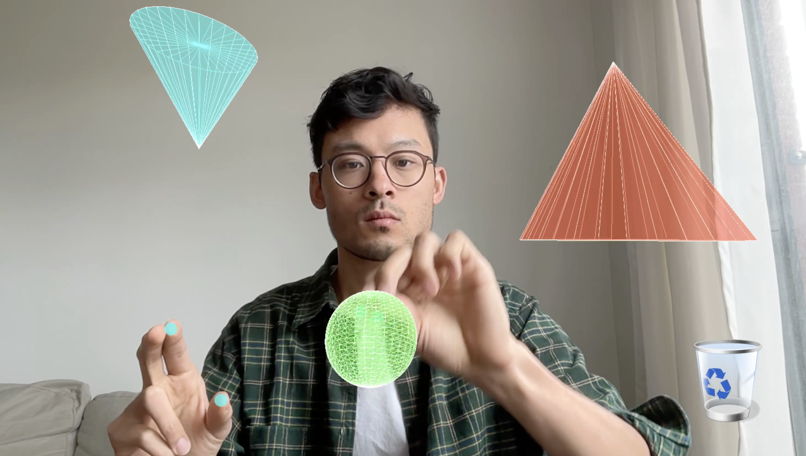

# 3D Hand Tracking Demo [Shape Creator]

A threejs / WebGL / MediaPipe-powered interactive demo that allows you to control create and move 3D shapes using hand gestures in real-time.



## Demo

Try the live demo: [https://collidingscopes.github.io/shape-creator-tutorial/](https://collidingscopes.github.io/shape-creator-tutorial/)

## Requirements

- Modern web browser with WebGL support
- Camera access

## Technologies

- **Three.js** for 3D rendering
- **MediaPipe** for hand tracking and gesture recognition
- **HTML5 Canvas** for visual feedback
- **JavaScript** for real-time interaction

## Setup for Development

```bash
# Clone this repository
git clone https://github.com/collidingScopes/shape-creator-tutorial

# Navigate to the project directory
cd shape-creator-tutorial
# Serve with your preferred method (example using Python)
python -m http.server
```

Then navigate to `http://localhost:8000` in your browser.

## License

MIT License

## Credits

- Three.js - https://threejs.org/
- MediaPipe - https://mediapipe.dev/

## Related Projects

You might also like some of my other open source projects:

- [Threejs hand tracking tutorial](https://collidingScopes.github.io/threejs-handtracking-101) - Basic hand tracking setup with threejs and MediaPipe computer vision
- [Particular Drift](https://collidingScopes.github.io/particular-drift) - Turn photos into flowing particle animations
- [Liquid Logo](https://collidingScopes.github.io/liquid-logo) - Transform logos and icons into liquid metal animations
- [Video-to-ASCII](https://collidingScopes.github.io/ascii) - Convert videos into ASCII pixel art

## Contact

- Instagram: [@stereo.drift](https://www.instagram.com/stereo.drift/)
- Twitter/X: [@measure_plan](https://x.com/measure_plan)
- Email: [stereodriftvisuals@gmail.com](mailto:stereodriftvisuals@gmail.com)
- GitHub: [collidingScopes](https://github.com/collidingScopes)

## Donations

If you found this tool useful, feel free to buy me a coffee. 

My name is Alan, and I enjoy building open source software for computer vision, games, and more. This would be much appreciated during late-night coding sessions!

[](https://www.buymeacoffee.com/stereoDrift)